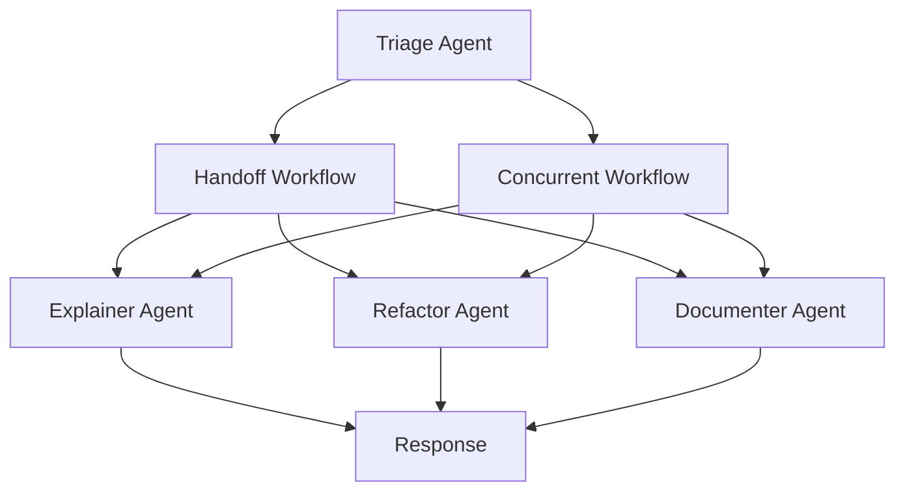
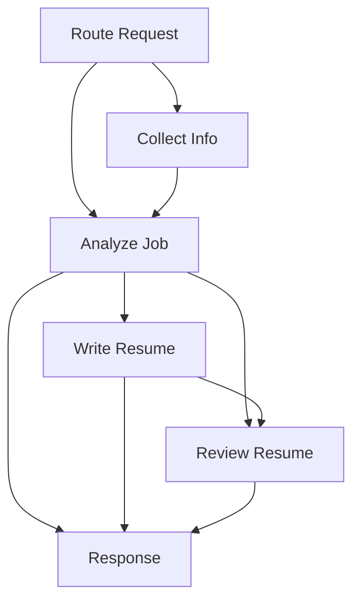

# Resume Agent (Microsoft Agent Framework)

Simple resume assistant built on Microsoft Agent Framework that routes user requests
through four steps: collect user info, analyze job description, write a tailored resume,
and provide feedback.

## Setup
1. Create and activate a virtual environment.
2. Install dependencies.
3. Configure environment variables.

## Quick Start
```bash
python3 -m venv .venv
source .venv/bin/activate
pip3 install -r requirements.txt
```
If `agent-framework-orchestrations` requires pre-release packages in your environment:
```bash
pip3 install -r requirements.txt --pre
```

Create a `.env` file using `.env.sample` and fill in the values.

Run the resume demo:
```bash
python3 run_demo.py
```

Run the code assistant demo:
```bash
python3 code_assistant/demo.py
```

## Demo Inputs and Results
- `run_demo.py` currently includes a sample resume and job description.
- For testing, replace `sample_user_input` with your own resume text and update `sample_job_description` with the target job details.
- The generated LaTeX resume is saved to `resume_result/resume.tex`.
- Console output shows each agent’s output (summarized for readability).

## Configuration
- Environment variables are read from `.env`:
  - `AZURE_OPENAI_ENDPOINT`
  - `AZURE_OPENAI_API_KEY`
  - `AZURE_OPENAI_DEPLOYMENT_NAME`
  - `AZURE_OPENAI_API_VERSION` (optional)
- `config.json` and `resume_assistant/config.json` are legacy references and are not used by the current Agent Framework flow.

## Project Structure
- `code_assistant/agents.py`: explainer/refactor/document agents
- `code_assistant/definition.py`: router agent + tool definitions
- `code_assistant/workflows/`: handoff + concurrent workflows
- `resume_assistant/agents.py`: collector/analyzer/writer/reviewer agents
- `resume_assistant/definition.py`: router agent + tool definitions
- `resume_assistant/workflows/`: sequential workflows (full/write/review/analyze)

## Workflows (Graph)
Code Assistant (Handoff + Concurrent):


Resume Assistant (Graph/WorkflowBuilder with branching):

