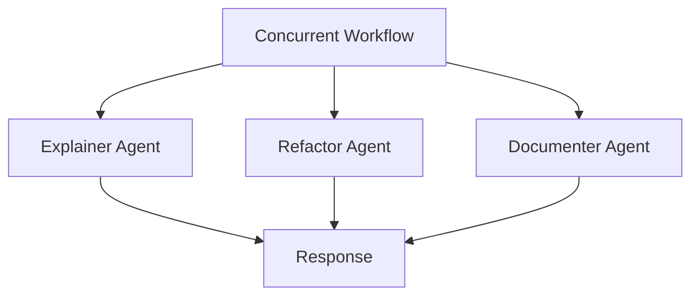

# Resume / Code Assistant (Microsoft Agent Framework)

Simple resume assistant and code assistant built on Microsoft Agent Framework 
Resume Assistant routes user requests through four steps: collect user info, analyze job description, write a tailored resume, and provide feedback.
Code Assistant routes user request through four steps : Triage, Explainer, Refactor, Documenter

## Setup
1. Create and activate a virtual environment.
2. Install dependencies.
3. Configure environment variables.

## Quick Start
```bash
python3 -m venv .venv
source .venv/bin/activate
pip3 install -r requirements.txt
```
If `agent-framework-orchestrations` requires pre-release packages in your environment:
```bash
pip3 install -r requirements.txt --pre
```

Create a `.env` file using `.env.sample` and fill in the values.

Run the resume demo:
```bash
python3 run_demo.py
```

Run the code assistant demo:
```bash
python3 code_assistant/demo.py
```

Run HTTP gateway for external frameworks:
```bash
python3 external_gateway.py --host 0.0.0.0 --port 8000
```

## Demo Inputs and Results
- `run_demo.py` currently includes a sample resume and job description.
- For testing, replace `sample_user_input` with your own resume text and update `sample_job_description` with the target job details.
- The generated LaTeX resume is saved to `resume_result/resume.tex`.
- Console output shows each agent’s output (summarized for readability).

## Configuration
- Environment variables are read from `.env`:
  - `AZURE_OPENAI_ENDPOINT`
  - `AZURE_OPENAI_API_KEY`
  - `AZURE_OPENAI_DEPLOYMENT_NAME`
  - `AZURE_OPENAI_API_VERSION` (optional)
- `config.json` and `resume_assistant/config.json` are legacy references and are not used by the current Agent Framework flow.

## Project Structure
- `code_assistant/agents.py`: explainer/refactor/document agents
- `code_assistant/definition.py`: router agent + tool definitions
- `code_assistant/workflows/`: handoff + concurrent workflows
- `resume_assistant/agents.py`: collector/analyzer/writer/reviewer agents
- `resume_assistant/definition.py`: router agent + tool definitions
- `resume_assistant/workflows/`: sequential workflows (full/write/review/analyze)

## Workflows (Graph)
Code Assistant (Concurrent Only):


Resume Assistant (Graph/WorkflowBuilder with branching):


## External Access
Use either direct Python imports (for in-process frameworks) or HTTP (for out-of-process frameworks).

Python import:
```python
from external_gateway import run_resume_agent, run_code_agent

resume_output = run_resume_agent(
    user_input="my resume text",
    job_description="target role description",
)

code_output = run_code_agent(
    user_request="refactor this function",
    code="def f(x): return x+1",
)
```

HTTP routes:
- `GET /health`
- `POST /v1/resume/run` body: `{"user_input":"...","job_description":"..."}`
- `POST /v1/code/run` body: `{"user_request":"...","code":"..."}`

Example:
```bash
curl -X POST http://localhost:8000/v1/resume/run \
  -H "Content-Type: application/json" \
  -d '{"user_input":"resume text","job_description":"backend engineer role"}'
```
